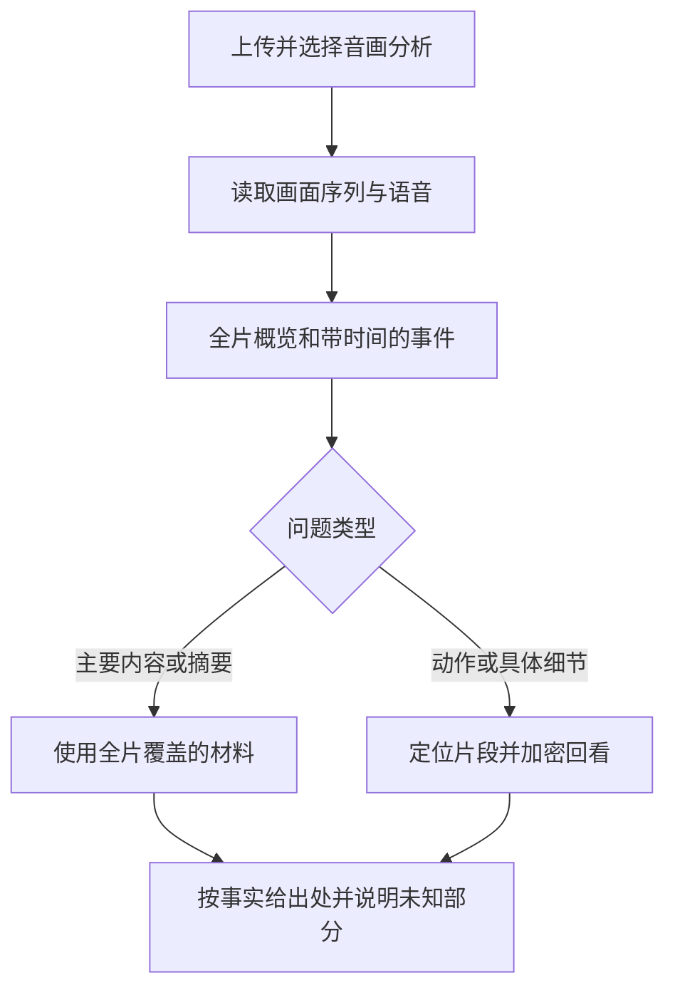

# 视频理解工作流调研与小样验证

日期：2026-09-08。本文保留接入前的调研与独立试验记录；其中“当前/尚未实现”指当时状态。用户随后批准实施，新路线现已接入；最终实现和验证以[视频工作流交接](video-workflow-validation.md)为准。

## 结论

当前结果不能仅归因于模型档位。已经确认的薄弱点是：语音误识别、稀疏采样遗漏动作、逐帧描述丢失时序、问答与核验只接触生成的文字。引用存在只能证明回答引用了某段材料，不能证明那段识别材料符合原视频。

建议保留已有产品与服务骨架，优先复用 Qwen 官方视频输入流程；短视频直接进行时序理解，长视频再做片段检索与原始画面复核。暂不扩写逐帧 caption → 纯文本 RAG 作为唯一理解来源的方案。

## 当前实际流程

1. 上传视频，Worker 提取音频，本地 Whisper base 转写。
2. 新代码默认启用视觉阶段：均匀取样，约 3 秒一帧，上限默认 24 帧；本次 30 秒素材取了 11 帧。
3. 每批最多 6 张图片送到视觉模型，要求每张独立给出文字观察。
4. 语音块与画面观察文字共同建立索引。问答检索文字，摘要汇总文字，核验器仍然读取文字。
5. 回答和摘要可以带画面来源的时间戳，但生成答案时没有重新读取原图或视频片段。

相关代码：`backend/src/listen_dragon/infrastructure/vision.py`、`worker.py`、`services/grounded_generation.py`、`services/llm_generation.py`。

### 画面分析何时开启

| 情况 | 当前行为 |
| --- | --- |
| 升级前已 READY 的视频 | 不会自动补分析；需在画面面板触发补充分析 |
| 新代码、新上传视频、视觉配置可用 | 转写后进入 VISUALIZING，再建索引 |
| 视觉禁用或失败，但有语音 | 仍可能完成语音处理；应明确标识只能依据语音 |
| 当前这次本地测试运行 | Worker 通过 WORKER_VIDEO_ID 仅领取已获授权的 DSCF0106，不能当作不受限的通用上传服务 |

Sintel 是升级前的旧视频，目前没有视觉结果。它的拒答不能当作视觉模型的能力测试。课程讲解可仅依赖语音做“讲述内容”的摘要；动作短片、电影、无声演示的视觉内容不能这样保证覆盖。

## 查到的可复用方案

### 1. Qwen 官方视频理解示例：首选的最小接入路线

[官方 API 文档](https://www.alibabacloud.com/help/en/model-studio/vision)支持视频文件和有序帧列表，并提供采样频率设置。该视觉接口不理解视频音轨，因此需要另接转写。快速动作需要提高采样密度。

[Qwen3-VL 官方 notebook](https://github.com/QwenLM/Qwen3-VL/blob/main/cookbooks/video_understanding.ipynb)包含本地推理与 API 两种写法。API 路线无需下载本地大视觉模型。本次读过 notebook 的源代码，核对了 OpenAI compatible 的 `type: video` 帧列表格式。

建议复用请求协议、时间信息组织方式及官方 SDK，保留已有 HTTP 错误处理、上传存储、会话与证据跳转。不能直接把 notebook 当成完整产品：它没有替我们实现历史版本、缓存失效、结果质量验收等逻辑。

### 2. Gemini 官方视频 API：音画原生联合理解的备选基线

[官方文档](https://ai.google.dev/gemini-api/docs/video-understanding)提供音画联合处理、时间戳、片段范围与采样配置。默认采样仍可能遗漏快速动作，不能把“原生视频输入”理解为每帧无损观看。

适合先建立简单效果基线。需要另一个供应商的配置与素材发送授权；本次未调用、未上传任何素材到 Google，也没有验证在当前网络与账号下的可用性。

### 3. VideoDB：更完整的托管工作流

[Python SDK](https://github.com/video-db/videodb-python)和[官方 cookbook](https://github.com/video-db/videodb-cookbook)提供上传、语音/视觉分析、时间戳产物、索引及检索示例。当前 SDK 将流程拆为 Understand → Index → Retrieve。

这是少写基础设施代码的候选，但依赖 VideoDB 的外部服务与 API key；开源 SDK 不代表整套后端可本地部署。尚未安装或实测，费用和效果需单独核对。

### 4. HKUDS/VideoRAG：长视频检索的参考实现

[仓库](https://github.com/HKUDS/VideoRAG)可参考多模态检索与长视频上下文组织。[算法安装说明](https://github.com/HKUDS/VideoRAG/blob/main/VideoRAG-algorithm/README.md)包含 PyTorch、ImageBind、MiniCPM、Whisper 等依赖与检查点，展示了 24GB GPU 配置，并说明其测试以英语环境为主。桌面发行版的 Windows 支持在 README 中仍标为待推出。

因此不把它视为本机可直接替换的轻量库。仓库 [LICENSE](https://github.com/HKUDS/VideoRAG/blob/main/LICENSE)还区分框架与集成模型的许可，不能笼统称完整实现为纯 MIT。未安装、未运行其测试或复现其论文指标。

## 本次独立真实请求结果

保持本地当前 Qwen 模型与供应商配置不变；不读取或输出 .env 内容。只发送明确获准的 DSCF0106 抽样画面与测试问题，没有发送原视频、音轨或转写。

| 输入 | HTTP | 模型概括 | 请求耗时 | 总 token |
| --- | --- | --- | --- | --- |
| 同一批 11 帧，覆盖约 30 秒，官方有序视频帧输入 | 200 | “一个人将西瓜掰开并展示果肉” | 3.88 秒 | 2096 |
| 开头 0–5.75 秒共 24 帧，4 fps | 200 | “一个人徒手将一个西瓜掰成两半” | 4.06 秒 | 3954 |

耗时仅为单次外部请求，不包含抽帧、上传处理、索引或完整页面链路，不能当作稳定性能指标。

人工查看本地 1.5、2.5、3.0、3.75 秒帧：有挥掌姿态、裂开的瓜体、双手分开和露出果肉等状态。主题已比逐帧物品罗列更贴近内容，但模型对“劈/掰”动作仍概括粗，11 帧结果的引用时间还偏向事后状态。没有逐事件完整标注，因此没有宣布时间定位准确率或工具判断全部通过。

这不是严格单变量对照：除了输入协议，还改变了提示、上下文和采样密度；也没有更换模型进行 A/B。它证明现有接口和模型可以直接理解该素材的主体，不足以证明哪一项改变单独造成改善。

含转写的额外对照被自动审批拒绝，理由是本轮素材外发授权只明确覆盖画面。随后将脚本缩小到纯画面并获准执行，因此没有进行音画融合效果的对照验证。

本地复现脚本（不随仓库提交）：`../tmp/e2e-tools/compare_video_workflow.py`；运行默认参数可复现 11 帧请求，参数 `--dense-first-six` 可复现 24 帧请求。脚本绑定指定素材，不读取其他视频；需要相同的本地样本、既有应用配置与外发授权。

## 推荐接入顺序与验收

1. 保留现有 UI、上传/Worker、播放/Range、持久化和会话骨架。增加一个薄的官方视频理解适配器，不重新开发整个产品。
2. 短视频在模型输入预算内直接传画面序列，生成主体、事件与时间段；语音以独立来源提供，不将不连贯转写扩写为确定主题。
3. 对动作不清楚的片段加密取样复查。本次人工选了前 6 秒；自动定位和重采样尚未实现。
4. 长视频先按片段组织概览与检索；回答细节时重新读取相关片段的画面及语音材料。仅在真正需要长视频规模时引入更复杂框架。
5. UI 明确显示“仅语音 / 音画已分析 / 画面处理失败”，旧素材提供显式升级入口，不能让用户从 READY 推断音画均已完成。
6. 用固定问题检查主题、动作顺序、工具、语音内容、无依据拒答、时间跳转；以用户确认的素材事实作为基准，再做同输入不同模型对照。

## 当前工作边界

此前工程检查记录为后端 138 项通过、Ruff 通过、pip check 通过，前端 27 项通过与生产构建通过；后续的提示/界面文字变更不全部对应当时正在运行的进程或构建。不能将这些工程检查等同于本轮语义效果验收。

当前分支 `codex/visual-understanding` 的视觉初版改动仍未提交。此次调研只新增本文和仓库外独立试验，未把官方帧序列路线接入网页，也未完成新路线的全链路验收。

## 第二轮调研：把“效果说得过去”转成明确方案

### Sintel 再次拒答的已知事实

用户新截图仍显示尚未分析画面。本轮只读检查 SQLite，Sintel 没有已持久化的视觉分析记录。这不是新视觉路线的效果复测，当前网页尚未接入该路线。

另一个独立的代码缺陷位于 `services/grounded_generation.py:123–147`：概括问题虽试图补全整段材料，却仍要求 `sources`（检索结果）非空。检索为空时直接构造拒答，不进行生成。因此，不能让全片概括依赖检索是否命中。这里确认的是代码路径风险，没有声称已追踪到截图中那次请求的全部拒答原因。

### 更多项目带来的具体经验

| 参考 | 已核对的做法 | 对 ListenDragon 的取舍 |
| --- | --- | --- |
| [NVIDIA VSS 2.3 架构](https://docs.nvidia.com/vss/2.3.0/content/architecture.html)与[分段调优说明](https://developer.nvidia.com/blog/?p=86011) | 连续视频分段后生成片段描述，融合转写；分段长度和重叠影响跨边界动作的保留 | 借鉴事件级描述、重叠窗口、整段摘要聚合；此处引用历史版本的明确设计，不把其旧模型清单当成当前推荐 |
| [VideoAgent，ECCV 2024](https://videoagent.github.io/)及[官方代码](https://github.com/YueFan1014/VideoAgent) | 时间记忆、片段定位之外，还能对目标视频片段直接做视觉问答 | 保留一个“回看片段”能力；不必为短视频引入其完整对象跟踪与工具体系 |
| [VideoTree，CVPR 2025](https://videotree2024.github.io/) | 根据问题相关性，从粗到细选择视频信息；最终仍可使用 caption 回答 | 借鉴按问题分配采样密度；不把整个树与额外本地模型作为首轮依赖 |
| [PySceneDetect 官方检测器文档](https://www.scenedetect.com/docs/latest/api/detectors.html) | 提供镜头切换与淡入淡出检测；自适应检测减轻相机运动引起的部分误检 | 直接使用现成库处理剪辑密集片段；镜头切换检测不能代替动作识别，连续镜头仍要保留时间采样 |
| [HKUDS/VideoAgent](https://github.com/HKUDS/VideoAgent) | 覆盖理解、剪辑、重制，安装涉及多种语音/生成模型 | 范围明显超出当前需求；不整体迁移，也不将其工作流构建指标当成本项目内容理解准确率 |

需要修正上一轮的过度概括：caption + RAG 并非天然无效。关键在于 caption 是否描述连续事件、是否覆盖相关信息，以及缺少细节时能否返回原视频获取证据。独立单帧描述加一次文字检索，不能代表上述项目的完整做法。

### 推荐架构：先建立简单可靠的短视频路径

1. **先验证理解后接网页。** 使用官方输入协议，在模型预算内传入覆盖全片的有序画面；超限时使用相邻重叠的短窗口，不把整片强行稀释成固定总帧数。保持每次素材发送在既有授权范围内。
2. **整体概括不经过检索门槛。** 直接使用全片概览和事件时间线。片段检索只服务细节定位，不负责决定视频是否有内容。
3. **融合时区分来源。** 画面回答发生了什么；语音回答说了什么。转写有疑点时对该段重新转写或回听，不能靠画面想象对白。原生音画模型可作为另一条基线。
4. **不清楚就回看一次。** 动作/工具等细节允许限定次数的局部高密度取样；仍没有依据就拒答该项，保留其他已确认事实，避免整条答案被一项不确定内容清空。
5. **字幕、事件和旧问答按版本管理。** 重新分析后重新生成概览，旧答案标为旧版本；从页面能看出实际用了哪些模态，以及处理是否完成。
6. **短视频通过后再做长视频扩展。** 保留已有搜索索引和产品骨架，暂不加入新的图数据库或多个 agent 框架。

### 模型选择和停止无效调参的规则

先在相同素材、问题、画面/音频覆盖范围下比较当前 Qwen 与一个更强的兼容视觉模型；配置与素材授权齐备时，再加入 Gemini 原生音画基线。模型比较必须和工作流比较分开记录。

- 直接输入也失败：检查采样/解码与模型能力，换模型或提高输入覆盖，暂停在 RAG 后端反复调提示。
- 直接输入成功、产品失败：定位检索丢失、时序组织、缓存或核验逻辑。
- 视觉成功、加转写后失败：检查 ASR 与融合策略。

不能预先宣称某个供应商必然胜出；本轮没有进行新的模型 API 对照，也没有将 Sintel 素材发送给任何外部服务。

### 建议首轮质量门槛（待实际验收，不是已达成指标）

准备 10 段 30–90 秒视频，覆盖动作、剪辑/预告片、对白、无声演示、屏幕文字，并保留未参与调参的样本。每段 6 个问题：1 个概括、3 个可见/可听事实、1 个事件顺序或定位、1 个无依据问题，共 60 项。

- 10 段的主体和主要内容都应正确，不能把背景物品/闲聊当主题。
- 40 项事实与时序题至少 36 项正确；动作先后不能颠倒。
- 10 项无依据题不得编造；因处理未完成而拒答不能算通过。
- 有人工标注的事件定位采用约 ±2 秒的首轮容差；快速动作另检查点击后能否实际看到对应动作，不能只看数值。
- 关键问题换一种说法并重复运行，记录不稳定结果；报告延迟与 token 用量，但先保证内容门槛。
- 接入后用真实网页重跑两段当前素材，确认服务/构建版本、视觉状态、答案内容与跳转都实际生效。接口 200 和单元测试通过不能代替这一步。

以上门槛是本项目建议，不是论文结论，也不代表达到它就覆盖所有视频类型。本轮完成了资料和本地状态核对，尚未实现此改造或执行这套质量验收。
